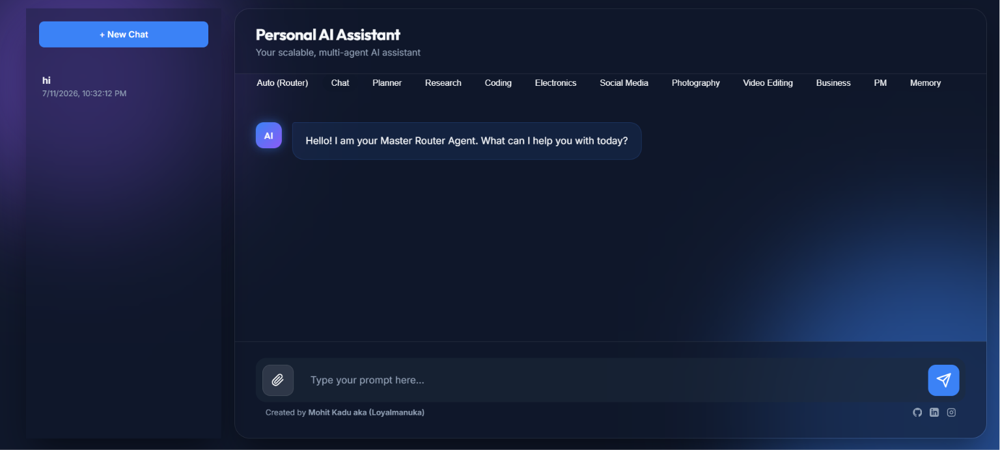
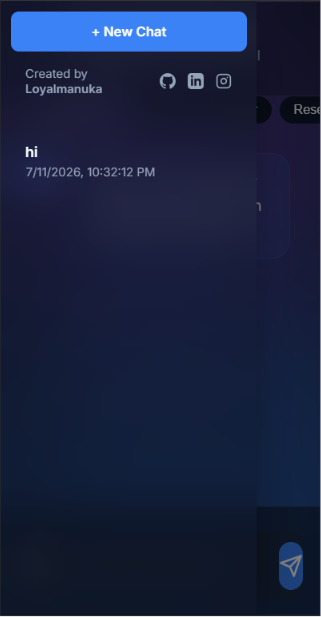
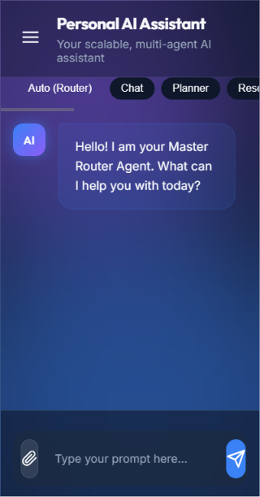

<div align="center">


<br/>

# 🤖 Personal AI Workspace

### *Not just a chatbot — your own AI team, working 24/7 for you.*

<br/>

[](https://python.org)|[](https://github.com/Mohitkadu16)|
| :------: | :------: |
[](https://fastapi.tiangolo.com) | [](https://linkedin.com/in/mohit-kadu-856410243/)| 
[](https://ai.google.dev) | [](https://instagram.com/loyalmanuka)|
[](https://ollama.com)|[](https://mohitkadu-dev.vercel.app/)|

</div>

---

## 🚀 Overview

> **Personal AI Workspace** is **not a chatbot**. It is a **Personal AI Operating System** — a multi-agent system that thinks like a professional team, not a single assistant.

Built specifically for **creators, builders & thinkers** — this system helps with:

<div align="center">

| 💻 Programming | 🔬 Research | 📱 Social Media | ⚡ Electronics |
|:-:|:-:|:-:|:-:|
| 🎬 Video Editing | 📸 Photography | 📋 Planning | 🏢 Business |
| 🧩 Memory | 🗺️ Project Mgmt | 💬 Chat | 🔀 Auto-Routing |

</div>

A **Master Router Agent** reads every request and intelligently sends it to the most qualified specialist. No manual selection needed.

---

## ✨ Features

<table>
  <tr>
    <td>🧠 <b>11 Specialized Agents</b></td>
    <td>A team of AI agents, each expert in one domain</td>
  </tr>
  <tr>
    <td>🔀 <b>Smart Auto-Router</b></td>
    <td>Automatically routes every task to the best agent</td>
  </tr>
  <tr>
    <td>☁️ <b>Dual LLM Support</b></td>
    <td>Google Gemini (cloud) + Ollama (100% local, no cost)</td>
  </tr>
  <tr>
    <td>💬 <b>Persistent Chat History</b></td>
    <td>All conversations saved, reloadable anytime</td>
  </tr>
  <tr>
    <td>📎 <b>File Attachments</b></td>
    <td>Upload PDFs, code files, text files — up to 10 at once</td>
  </tr>
  <tr>
    <td>🖼️ <b>Image Support</b></td>
    <td>Attach images for multimodal AI analysis</td>
  </tr>
  <tr>
    <td>📱 <b>Mobile Responsive</b></td>
    <td>Full hamburger menu, works on any screen size</td>
  </tr>
  <tr>
    <td>🔗 <b>REST API</b></td>
    <td>FastAPI backend with auto-docs at <code>/docs</code></td>
  </tr>
  <tr>
    <td>🌐 <b>Dark Web UI</b></td>
    <td>Glassmorphism design, smooth animations</td>
  </tr>
</table>

---

## 🧠 Architecture

<details>
<summary><b>Click to expand — Full system diagram</b></summary>

```
╔══════════════════════════════════════════════════════════════╗
║              Personal AI Workspace — System Map              ║
╠══════════════════════════════════════════════════════════════╣
║                                                              ║
║   🌐 Web UI (static/)                                        ║
║    └── User sends message → POST /api/v1/task                ║
║                                                              ║
║   ⚡ FastAPI Server (src/api.py)   [Port 8000]               ║
║    ├── POST /api/v1/task     ← Main task endpoint            ║
║    ├── POST /api/v1/upload   ← File & image uploads          ║
║    ├── GET  /api/v1/chats    ← Chat session list             ║
║    └── GET  /api/v1/chats/{id} ← Load chat history          ║
║                                                              ║
║   🔀 Router Agent                                            ║
║    └── Reads task → Scores agents → Routes to best one       ║
║                                                              ║
║   🤖 Specialized Agents (11 total)                           ║
║    ├── PlannerAgent          → Roadmaps & strategy           ║
║    ├── ResearchAgent         → Research & summarization      ║
║    ├── CodingAgent           → Code & debugging              ║
║    ├── ElectronicsPCBAgent   → Arduino, circuits, PCB        ║
║    ├── SocialMediaAgent      → Posts, captions, growth       ║
║    ├── VideoEditingAgent     → Scripts, workflows            ║
║    ├── PhotographyAgent      → Camera, composition           ║
║    ├── StudKitsBusinessAgent → Startup strategy              ║
║    ├── ProjectManagerAgent   → Timelines, tasks              ║
║    ├── MemoryAgent           → Notes & context               ║
║    └── ChatAgent             → General conversation          ║
║                                                              ║
║   🛠️ LLM Tools                                               ║
║    ├── GeminiTool   → Google Gemini API                      ║
║    └── OllamaTool   → Local model (Qwen, LLaVA, etc.)        ║
║                                                              ║
╚══════════════════════════════════════════════════════════════╝
```

</details>

**Request Flow:**

```
You ──► Web UI ──► FastAPI ──► Router Agent ──► Specialist Agent ──► LLM ──► Response
```

---

## 🤖 Meet the Agents

<div align="center">

| Agent | Emoji | What it does |
|:---|:---:|:---|
| **Master Router** | 🔀 | Reads your request and routes it to the right agent |
| **Planner** | 📋 | Project plans, roadmaps, strategy & schedules |
| **Research** | 🔬 | Deep research, summarization, fact-checking |
| **Coding** | 💻 | Code generation, debugging, architecture reviews |
| **Electronics & PCB** | ⚡ | Arduino, circuits, PCB layout, component selection |
| **Social Media** | 📱 | Posts, captions, hashtags, growth strategies |
| **Video Editing** | 🎬 | Workflows, effects, scripts, color grading |
| **Photography** | 📸 | Camera settings, composition, editing tips |
| **StudKits Business** | 🏢 | Startup strategy & content for StudKits |
| **Project Manager** | 🗺️ | Task tracking, timelines, progress reports |
| **Memory** | 🧩 | Notes, reminders, context retention |
| **General Chat** | 💬 | Everyday Q&A and conversation |

</div>

---

## 🔌 Supported Models

### ☁️ Cloud — Google Gemini API

| Model | Speed | Use Case |
|:---|:---:|:---|
| `gemini-2.0-flash` | ⚡ Fast | Default — capable, free tier available |
| `gemini-1.5-pro` | 🐢 Slower | High-context & complex reasoning |
| `gemini-1.5-flash` | ⚡ Fast | Quick responses |

### 🖥️ Local — Ollama (Runs offline, zero cost)

| Model | Type | Use Case |
|:---|:---:|:---|
| `qwen2.5:7b` | 💬 Text | General tasks — recommended default |
| `qwen2.5-coder:7b` | 💻 Code | Code generation & debugging |
| `llava` | 🖼️ Vision | Image analysis (multimodal) |
| `llama3.2` | 💬 Text | General purpose |

> 💡 **Pro Tip:** Set `LLM_PROVIDER=ollama` in `.env` to run **100% locally** with zero API cost!

---

## 🛠️ Tech Stack

<div align="center">

| Layer | Technology |
|:---|:---|
| 🐍 **Backend** | Python 3.10+, FastAPI, Uvicorn |
| 🤖 **AI / LLM** | Google Gemini API, Ollama |
| 🎨 **Frontend** | HTML5, CSS3 (Glassmorphism), Vanilla JS |
| 🗄️ **Storage** | JSON flat files (chat sessions) |
| 📄 **PDF Parsing** | PyPDF2 |
| 📎 **File Uploads** | python-multipart, FastAPI UploadFile |
| ⚙️ **Config** | python-dotenv, pydantic-settings |
| 🧪 **Testing** | pytest, mypy |

</div>

---

## ⚙️ Installation

### Step 1 — Clone the repository

```bash
git clone https://github.com/Mohitkadu16/personal-ai-workspace.git
cd personal-ai-workspace
```

### Step 2 — Create a virtual environment

```bash
python -m venv venv
```

```bash
# Windows
venv\Scripts\activate

# Linux / macOS
source venv/bin/activate
```

### Step 3 — Install dependencies

```bash
pip install -r requirements.txt
pip install PyPDF2 python-multipart
```

### Step 4 — Configure environment

```bash
cp .env.example .env
```
Open `.env` and fill in your values:

```env
# ─── Google Gemini API ─────────────────────────────────
# Get your free key at: https://aistudio.google.com
GEMINI_API_KEY=your_gemini_api_k

# LLM Provider: "gemini" or "ollama"
# ─── LLM Provider ──────────────────────────────────────
# Options: "gemini" or "ollama"
LLM_PROVIDER=gemini

# ─── Ollama (for local, offline mode) ──────────────────
OLLAMA_BASE_URL=http://localhost:11434
OLLAMA_MODEL=qwen2.5:7b
```

---

## ▶️ Running

### 🌐 Launch the Web UI + API Server

```bash
python -m src.api
```

The server binds to all network interfaces on port **8000**.

| Device | URL |
|:---|:---|
| 🖥️ Your PC | `http://localhost:8000` |
| 📱 Your Phone (same WiFi) | `http://<YOUR_LOCAL_IP>:8000` |
| 📖 API Docs (Swagger) | `http://localhost:8000/docs` |

> **Find your local IP:** Run `ipconfig` on Windows → look for `IPv4 Address`  
> Example: `http://192.168.1.5:8000`

### 💻 Run via CLI (terminal only, no web UI)

```bash
python -m src.main
```

---

## 🖥️ Screenshots

### 🖥️ Desktop View



### 📱 Mobile View

| Mobile — Sidebar (Hamburger Menu) | Mobile — Chat Interface |
|:---:|:---:|
|  |  |

---

## 🗺️ Roadmap

```
✅ Done                              🔜 Coming Soon
─────────────────────────────────    ─────────────────────────────
✅ Multi-agent routing system        🔜 Voice input support
✅ Persistent chat history           🔜 Vector memory (ChromaDB)
✅ Dark glassmorphism Web UI         🔜 Web search (Tavily / Serper)
✅ PDF & file upload support         🔜 Agent-to-agent messaging
✅ Image attachment support          🔜 Docker deployment
✅ Mobile responsive UI              🔜 Mobile app (React Native)
✅ Agent navigation tabs             🔜 Custom agent builder
```

---

## 📁 Project Structure

<details>
<summary><b>Click to expand — Full directory tree</b></summary>

```
ai_workspace/
│
├── 📁 src/
│   ├── 📁 agents/                  ← All 11 specialized agents
│   │   ├── base_agent.py           ← Abstract base class
│   │   ├── router_agent.py         ← Master routing logic
│   │   ├── chat_agent.py
│   │   ├── coding_agent.py
│   │   ├── planner_agent.py
│   │   └── ...
│   ├── 📁 configs/
│   │   ├── settings.py             ← .env loader (pydantic)
│   │   └── prompt_loader.py        ← All agent system prompts
│   ├── 📁 tools/
│   │   └── llm_tools.py            ← Gemini & Ollama wrappers
│   ├── 📁 utils/
│   │   ├── chat_manager.py         ← Persistent session storage
│   │   ├── file_parser.py          ← PDF & text extraction
│   │   └── logger.py               ← Structured logging
│   ├── api.py                      ← FastAPI application entry
│   └── main.py                     ← CLI runner
│
├── 📁 static/                      ← Web UI (served by FastAPI)
│   ├── index.html
│   ├── style.css
│   └── script.js
│
├── 📁 data/
│   ├── chats/                      ← Saved conversations (gitignored)
│   └── uploads/                    ← User uploads (gitignored)
│
├── 📁 docs/screenshots/            ← README screenshots
├── 📁 tests/
├── .env.example
├── .gitignore
├── requirements.txt
└── README.md
```

</details>

---

## 📜 License

This project is licensed under the **MIT License** — see the [LICENSE](LICENSE) file for details.

---

<div align="center">

### 💫 Built with passion by

## [Mohit Kadu aka Loyalmanuka](https://github.com/Mohitkadu16)


|[](https://github.com/Mohitkadu16)|[](https://linkedin.com/in/mohit-kadu-856410243/)|[](https://instagram.com/loyalmanuka)|
|:---|:---:|:---:|


> *"Not just an AI assistant — your Personal AI Assistant."*

**⭐ If this project helped you, please give it a star! It means a lot ⭐**
</div>

